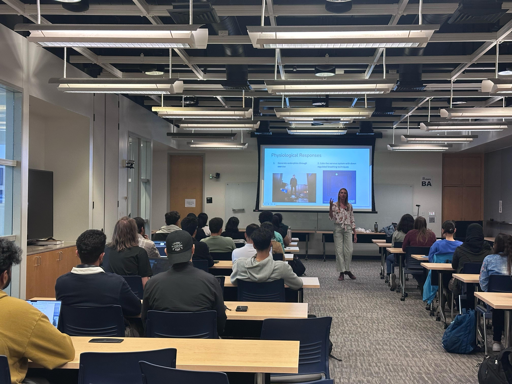
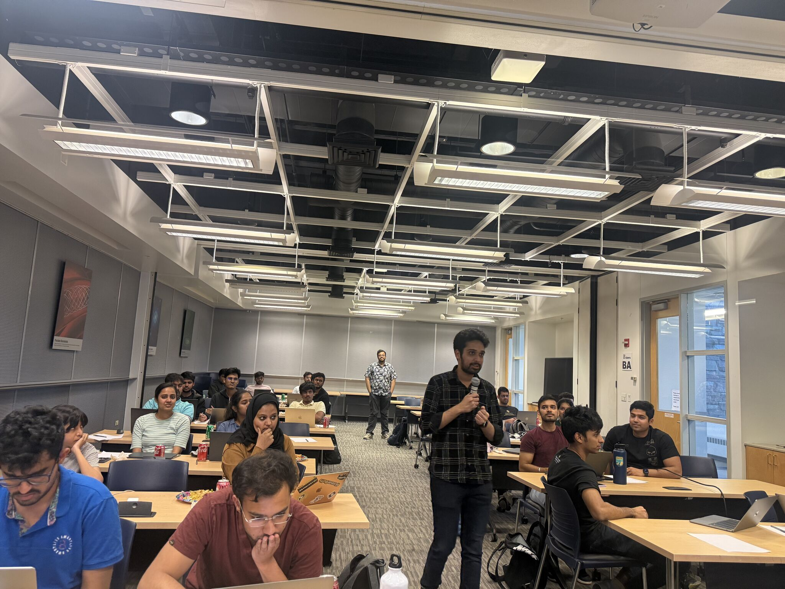
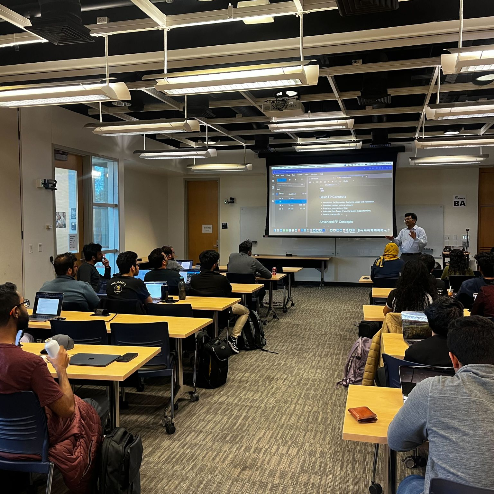
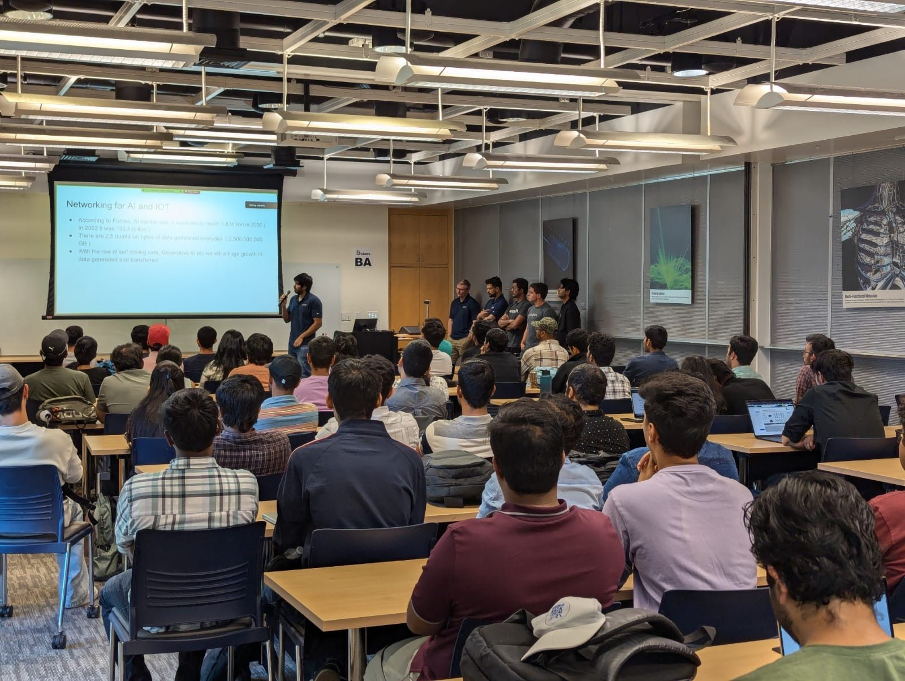
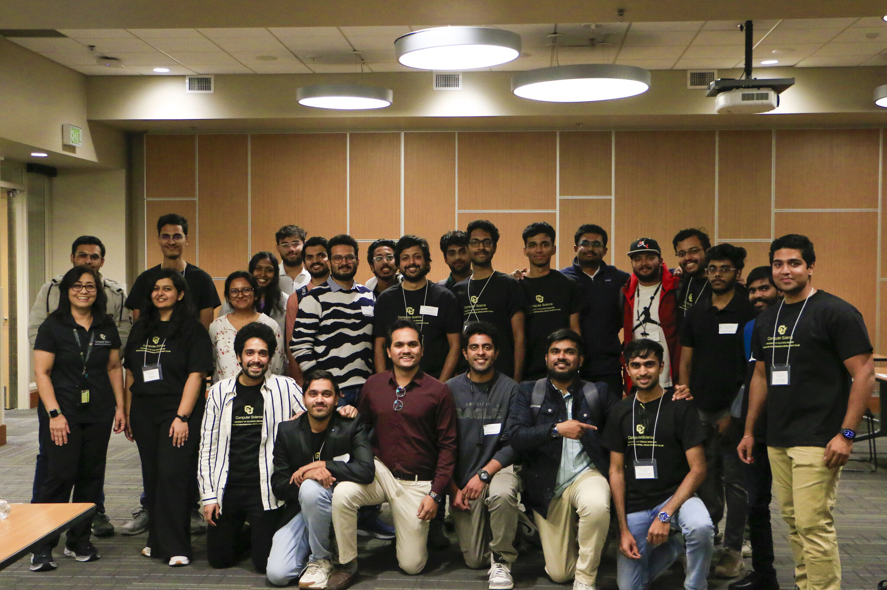
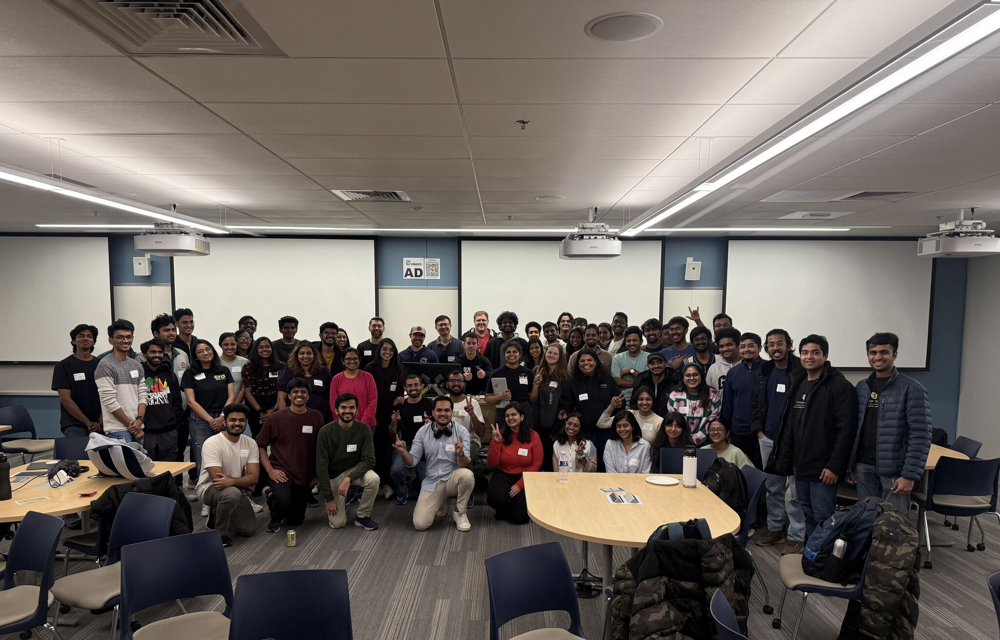

Welcome to the Graduate Professional Development Club's Events page! Here, you'll find a comprehensive overview of the various professional development activities we organize. Our events range from industry-specific workshops to competitive programming contests, all designed to enhance your skills and boost your career prospects. For our upcoming events schedule, please check the calendar on our [Index Page](/).

## Past Events

### Public Speaking Workshop with Audra Barber

    
    

        
We hosted an engaging workshop on public speaking with TEDx speaker Audra Barber, who shared practical strategies for overcoming imposter syndrome and improving presentation skills. Students practiced delivery techniques, learned how to craft compelling narratives, and left with tools to communicate confidently in interviews and conferences.

    

### Career Roundtable with Arjun (CU Boulder Alumnus)

    
    

    
In a candid roundtable hosted by GPDC, CU Boulder alumnus Arjun shared personal insights on navigating the tech industry. From building curiosity to embracing perseverance, students gained valuable advice through open dialogue. The session emphasized real-world challenges, active networking, and the importance of staying curious in uncertain times.

    

### Triwizard Coding Champion Challenge

    
    

    
GPDC hosted a high-energy coding competition featuring algorithmic challenges on arrays, stacks, trees, and graph traversal. With hidden test cases and time-based tie-breakers, participants raced against the clock to solve problems with both logic and speed. The event celebrated problem-solving under pressure and fostered a vibrant coding culture within the CS community.

    

### Functional Programming & Game Development Workshop by Prof. Sriram

    
    

    
In this hands-on workshop led by Prof. Sriram, students explored event-driven functional programming through the lens of arcade-style game development. Topics like trampolining, continuations, and functional reactive programming were demystified with practical examples. The session offered a rare chance to learn directly from faculty and apply advanced concepts in a fun, interactive setting.

    

### Tech Talks with Arista Networks

    
    

   
GPDC hosted two insightful sessions with Arista Networks, featuring career talks from their software engineers and a deep dive into AI-driven networking advancements. The event also included an engaging in-person meet-and-greet, offering students a unique opportunity to connect with industry professionals and learn about careers in networking.

    

### Tech Connect with Akshit Arora (NVIDIA)

    <!---->
    

    
CU Boulder alumnus Akshit Arora joined us for a deep dive into real-world applications of conversational AI and text-to-speech systems, sharing insights from his work at NVIDIA and inspiring students interested in cutting-edge AI technologies.
    
    

### 2024 Mock Interview Series

    
    

    
GPDC successfully hosted its annual Mock Interview Series with participation from professionals at top companies like Google, Meta, LinkedIn, Amazon, and more. Students practiced system design, coding, and AI interviews, receiving personalized feedback and real-world insights. The event empowered participants to navigate tech interviews with greater confidence and clarity.

    

### AWS Hackathon

    
    

    
GPDC hosted an exciting AWS Hackathon that brought together 17 teams for a day of fast-paced problem-solving and innovation. The event featured a cybersecurity session, a 2-hour challenge jam with 13 AWS tasks, and a panel discussion on cloud security and GenAI. With expert mentorship and high energy, participants gained hands-on experience tackling real-world tech challenges.

    

<!--### Company Info Sessions and On-Campus Interviews
We facilitated info sessions with notable companies like Arista and Lucid Software, who shared insights into their work, their hiring processes, and even conducted on-campus interviews. This event was a significant opportunity for students to network and secure job offers directly.-->

<!--### Competitive Programming Contests

    
    

        
Each semester, we organize competitive programming contests with attractive cash prizes. These contests are designed to sharpen coding skills and foster a competitive spirit among students.

    

-->

## Regular Events and Speaker Series

### Fall 2024 Speaker Series
This semester, GPDC hosted a powerful speaker series featuring leaders from big Techs. Topics ranged from AI in manufacturing and startup investing to research careers and ML interview prep. The series offered students unique perspectives and practical advice for navigating careers in tech and research.

### Spring Resume Review Session
In this career-focused event, students received personalized resume feedback from alumni and industry professionals. The session helped attendees refine their resumes, highlight their strengths, and improve their job-readiness ahead of the recruiting season.

### Coding Interview Prep Workshop
This interactive workshop focused on tackling popular interview problems from top tech companies like Google and Meta. The session encouraged collaborative problem-solving and multiple approaches, helping students build confidence and identify areas for growth. A high-energy, hands-on session that left attendees inspired and better prepared.

Remember to check our calendar on the [Index Page](/) to keep up to date with all our events and activities!

