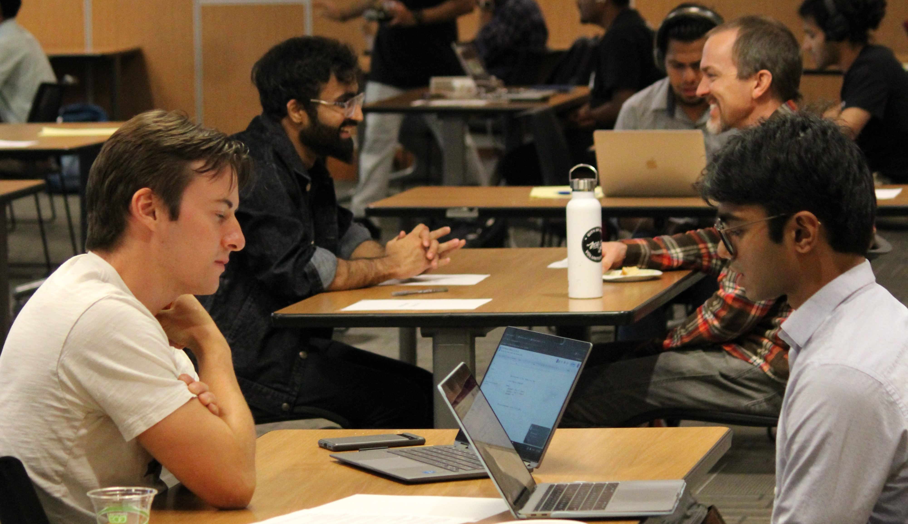
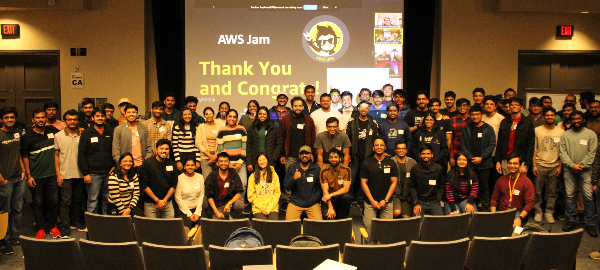
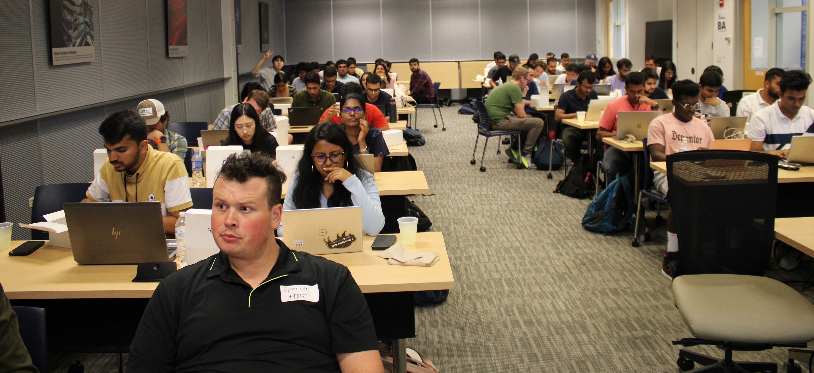

Welcome to the Graduate Professional Development Club's Events page! Here, you'll find a comprehensive overview of the various professional development activities we organize. Our events range from industry-specific workshops to competitive programming contests, all designed to enhance your skills and boost your career prospects. For our upcoming events schedule, please check the calendar on our [Index Page](/).

## Past Events

### Mock Interviews

    
    

        
We organized mock interviews with industry professionals to help students prepare for internship and full-time roles. This provided invaluable practice and feedback, mimicking real interview scenarios in the tech industry.

    

### AWS Hackathon

    
    

        
In collaboration with AWS, we hosted a hackathon focused on cloud technologies. Participants had the opportunity to work on a variety of challenges using AWS platforms, enhancing their skills in cloud computing.

    

### Company Info Sessions and On-Campus Interviews
We facilitated info sessions with notable companies like Arista and Lucid Software, who shared insights into their work, their hiring processes, and even conducted on-campus interviews. This event was a significant opportunity for students to network and secure job offers directly.

### Competitive Programming Contests

    
    

        
Each semester, we organize competitive programming contests with attractive cash prizes. These contests are designed to sharpen coding skills and foster a competitive spirit among students.

    

## Regular Events and Speaker Series

### Weekly Speaker Series
Every week, we invite a reputed industry speaker to present on topics crucial for professional development, such as optimizing resumes for ATS, effective networking, and interview strategies. These sessions are great for staying updated with industry trends and best practices.

### Weekly Sessions
Our weekly sessions are geared towards skill improvement, featuring activities like LeetCode coding sessions, mock demo interviews showcasing the dos and don'ts, and resume review sessions. These are designed to provide hands-on experience and direct feedback to enhance your job-seeking skills.

Remember to check our calendar on the [Index Page](/) to keep up to date with all our events and activities!

