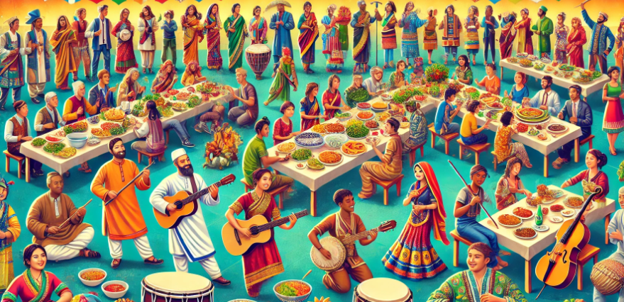
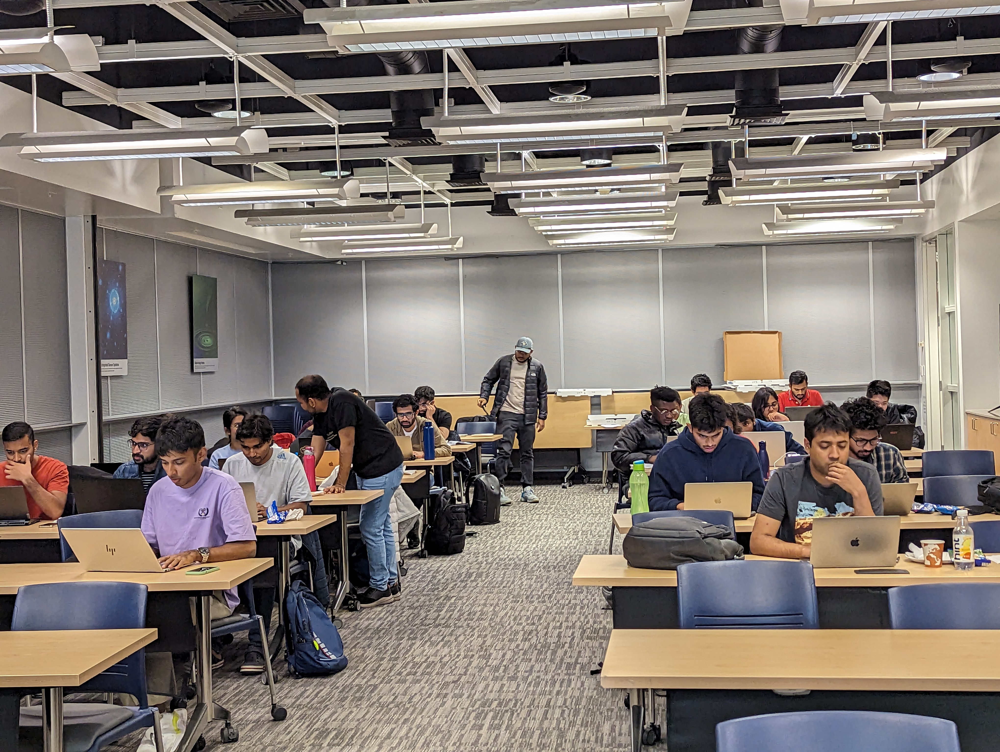
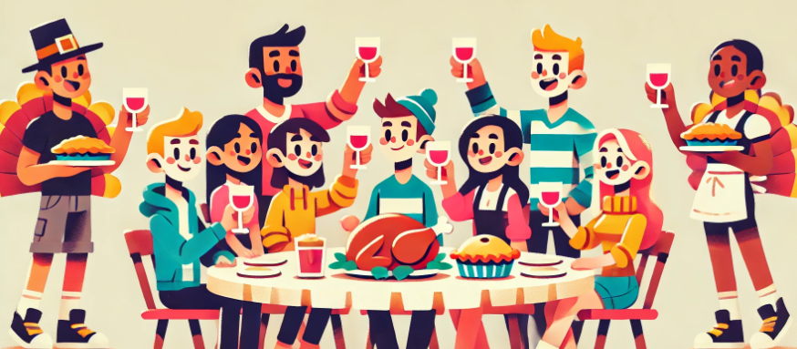

# GPDC and CSGSA Events Page

Welcome to our collaborative events page! Here, you will find detailed information about the activities and events organized by both the Graduate Professional Development Club (GPDC) and the Computer Science Graduate Student Association (CSGSA). Our offerings range from professional development workshops to cultural festivities, all designed to enrich your university experience.

<button onclick="filterEvents('GPDC')">GPDC</button>
<button onclick="filterEvents('CSGSA')">CSGSA</button>
<button onclick="filterEvents('all')">All</button>

# September 2024

    <h2>Industry Speaker Series</h2>
    

        
        

            
Join us for enlightening discussions with industry experts about the evolving landscape of technology and business. These sessions provide insights into emerging industry trends and professional development opportunities. 
 
            
            <h3>When? September 13th </h3>
            <h3> Where? DLC1B70 </h3>
        

    

# October 2024

    <h2>Cross Cultural Celebrations </h2>
    

        
        

            
Celebrate the rich diversity of our community with a potluck, featuring dance and musical performances. A vibrant display of cultures, this event is a cornerstone of our fall semester activities.

            <h3>When?  October 11th</h3>
            <h3> Where?  DLC 1B70</h3>
        

    

    <h2>Industry Speaker Series </h2>
    

        
        

            
Continue your professional growth with another talk by an expert who will delve into the nuances of technological advancements and career development.

            <h3>When?  October 18th</h3>
            <h3> Where? tbd </h3>
        

    

    <h2>Mock Interviews</h2>
    

        
        

            
Gain practical experience and personalized feedback from industry professionals to prepare for real job interviews. This event is a must for those seeking internships or full-time positions.

            <h3>When?  October 25th</h3>
            <h3> Where?  Kitteredge Central</h3>
        

    

# November 2024

    <h3>Industry Speaker Series</h3>
    

        
        

            
Our final speaker event of the semester offers a unique opportunity to engage with experts in the industry and discover career paths you might never have considered.

            <h3>When? November 8th </h3>
            <h3> Where? tbd </h3>
        

    

    <h2>Code Buffer </h2>
    

        
        

            
Compete in our prestigious coding challenge for a chance to win substantial cash prizes and demonstrate your coding expertise in a competitive yet friendly environment.

            <h3>When?  November 15th</h3>
            <h3> Where? DLC1B70 </h3>
        

    

    <h2>Friendsgiving</h2>
    

        
        

            
Join us for a heartwarming celebration of thanks and gratitude as we gather together to share a meal and give back to the community through our food drive.

            <h3>When? November 21st </h3>
            <h3> Where? DLC1B70 </h3>
        

    

    <h2>Town Hall Meeting</h2>
    

        
        

            
Discuss vital departmental issues, such as student facilities and other important topics, in this forum. Your input directly influences our ability to advocate for improvements within the department.

            <h3>When?  November 21st</h3>
            <h3> Where? DLC1B70 </h3>
        

    

# December 2024

    <h2>TeaTime++</h2>
    

        
        

            
Enjoy an extended version of our regular Tea Time, with more snacks, a variety of teas, and plenty of time for those longer board games that are perfect for strategic thinkers.

            <h3>When? December 8th </h3>
            <h3> Where? DLC1B70 </h3>
        

    

